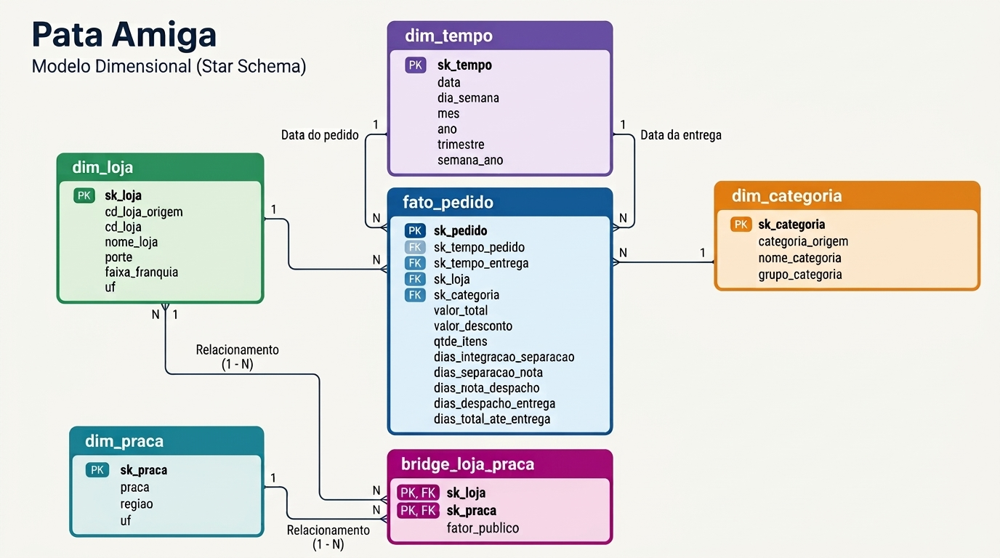

# _Modulo2_MiniProjeto Avaliativo - Pata Amiga - Lucas Nunes da Rosa_t2

Projeto desenvolvido em MySQL para analisar os pedidos da rede Pata Amiga, utilizando um modelo dimensional e consultas SQL para responder cinco perguntas de negócio.

## Estrutura do projeto

- `sql/00-conferencia.sql` - conferência dos dados
- `sql/01-carga-staging.sql` - carga dos dados
- `sql/02-dimensoes-prontas.sql` - criação das tabelas
- `sql/03-dimensoes.sql` - criação e carga das dimensões
- `sql/04-fato.sql` - carga da tabela fato
- `sql/05-perguntas.sql` - consultas das perguntas de negócio
- `docs/diagrama_estrela.png` - modelo dimensional

## Conferência da origem

Antes da modelagem, foram conferidos alguns pontos da base de origem:

- **Grafias de loja:** 32
- **Grafias de categoria:** 37
- **Pedidos sem código de loja:** 1.575
- **Marcos de processo em branco:** 6.033
- **pedidos sem loja** 3
Os marcos de processo em branco foram distribuídos da seguinte forma:

- Separação: 1.077
- Emissão da nota: 1.338
- Despacho: 1.665
- Entrega: 1.953

*O projeto utiliza um modelo dimensional em formato Star Schema.*

## Perguntas de negócio

### P1 - Onde está o gargalo do processo de entrega?

Foram calculadas as médias dos quatro intervalos do processo, agrupadas pelo porte das lojas.

O principal gargalo está na etapa **Nota -> Despacho**, sendo mais evidente nas lojas pequenas, com média de **8,53 dias**. Nas lojas grandes e médias, essa também é a etapa mais demorada.

As lojas pequenas apresentam ainda o maior tempo total do processo, com **15,16 dias**, praticamente o dobro das lojas grandes e médias.

Os valores devem ser interpretados considerando que o `AVG` ignora `NULL`. Assim, pedidos que não concluíram determinada etapa não entram na média daquela etapa. A análise identifica onde ocorre a maior demora, mas não permite afirmar a causa do problema, pois a base não possui informações suficientes sobre equipe, capacidade operacional, transportadoras ou motivos dos atrasos.

### P2 - Qual categoria concentra o faturamento?

A categoria **Ração** concentra o maior faturamento, com **R$ 1.076.202,55**, representando **60,01%** do faturamento total da rede, que foi de **R$ 1.793.308,51**.

A forte concentração mostra a importância da categoria Ração para as vendas da rede. Porém, isso não permite afirmar que seja a categoria mais lucrativa, pois a base não possui informações sobre custos e margem.
### P3 - O desconto funciona igual em todo canal?

Foi comparado o ticket médio dos pedidos com e sem desconto dentro de cada canal, além do faturamento e da participação de cada canal na receita total.

O ticket médio com desconto é maior que o ticket sem desconto em todos os canais. A diferença, porém, varia entre os canais, **indicando que o comportamento não é igual em todos eles**.

O **App** concentra a maior participação do faturamento, com **30,79%**, seguido pelo **Site**, com **25,13%**.

Apesar da diferença observada nos tickets, os dados não permitem afirmar que o desconto foi a causa direta do aumento do ticket, pois fatores como quantidade de itens, produtos comprados e perfil dos clientes também podem influenciar o resultado.

### P4 - Qual praça concentra o faturamento?

A praça que concentra o maior faturamento é o **Vale do Itajaí**, com **R$ 633.740,09**, representando **35,34%** do faturamento da rede.

### P5 - Onde abrir a próxima loja?

As lojas foram comparadas pelo número de itens vendidos por mil habitantes e pelo tempo médio de entrega.

A **Pata Amiga Rio dos Cedros** ficou em 1º lugar no indicador de demanda, com **41,87 itens por mil habitantes** e tempo médio de entrega de **14,24 dias**.

Com base nos dados disponíveis, **Rio dos Cedros seria a primeira região que eu investigaria para a abertura de uma nova loja**, pois apresenta a maior demanda relativa à população entre as lojas analisadas.

O tempo médio de entrega, porém, é um ponto de atenção. Antes da abertura, seria necessário verificar se esse tempo elevado está relacionado à distância, logística ou capacidade operacional. Também seria importante analisar concorrência, aluguel, renda da população e crescimento da região.

Portanto, **Rio dos Cedros é a principal oportunidade identificada pela análise, mas a decisão final dependeria de uma análise comercial e logística complementar**.

**P5(a) - Ranqueie as lojas por itens POR MIL HABITANTES**

As lojas foram ranqueadas pelo número de itens vendidos por mil habitantes, juntamente com o tempo médio de entrega.

As primeiras posições foram:

1. **Pata Amiga Rio dos Cedros** — 41,87 itens/1.000 habitantes — 14,24 dias
2. **Pata Amiga Presidente Getúlio** — 34,84 itens/1.000 habitantes — 14,32 dias
3. **Pata Amiga Ibiranã** — 32,07 itens/1.000 habitantes — 15,75 dias
4. **Pata Amiga Itapoá** — 25,94 itens/1.000 habitantes — 14,97 dias
5. **Pata Amiga Santo Amaro da Imperatriz** — 23,71 itens/1.000 habitantes — 15,77 dias
6. **Pata Amiga Taió** — 19,37 itens/1.000 habitantes — 14,59 dias
7. **Pata Amiga Timbó** — 17,86 itens/1.000 habitantes — 7,73 dias

A loja com maior demanda relativa foi a **Pata Amiga Rio dos Cedros**, com **41,87 itens por mil habitantes**.

Timbó também aparece como uma alternativa interessante, apresentando 17,86 itens por mil habitantes e um tempo médio de entrega de apenas 7,73 dias. Apesar de possuir uma demanda relativa menor que Rio dos Cedros, apresenta um indicador logístico mais favorável.
Esse indicador ajuda a identificar regiões com maior intensidade de vendas em relação à população, mas não é suficiente sozinho para decidir a abertura de uma nova loja, pois não considera fatores como concorrência, aluguel, renda da população e crescimento da região.

**P5(b) - Faturamento por faixa de franquia**

A faixa Ouro apresenta o maior faturamento, porém esse resultado **não permite afirmar quanto veio de lojas que já eram Ouro na data do pedido**. Isso acontece porque o cadastro da loja possui apenas a faixa atual, funcionando como uma foto de hoje. Sem um histórico das mudanças de faixa, uma loja que atualmente é Ouro pode ter realizado pedidos quando ainda pertencia a outra faixa.

Portanto, o resultado representa o faturamento dos pedidos associados à faixa atual das lojas, e não necessariamente o faturamento histórico de cada faixa.

**P5(c) - Qualidade e dados incompletos**

Foram analisados os registros com informações ausentes ou incompletas. Foram encontrados **3 pedidos sem loja**, **1.953 entregas não concluídas**, **257 pedidos com itens em branco** e **121 pedidos com valores em branco**.

Esses dados precisam ser considerados na interpretação dos resultados, pois informações ausentes podem reduzir a precisão das análises e influenciar decisões de negócio.

## Limitações dos dados

A base possui informações ausentes em algumas etapas do processo de entrega, pedidos sem loja identificada e valores ou quantidades em branco. Além disso, não existe histórico das alterações das faixas de franquia.

Por isso, os resultados devem ser utilizados como apoio à decisão e não como única fonte para decisões comerciais.

## Recomendação final

A recomendação é utilizar **itens por mil habitantes e tempo médio de entrega** como primeiro filtro para identificar regiões com potencial de expansão.

Antes de abrir uma nova loja, a análise deve ser complementada com informações sobre concorrência, aluguel, renda da população, crescimento da região, custos operacionais e potencial de novos clientes.

Dessa forma, os dados permitem identificar **onde vale a pena investigar uma oportunidade**, mas não determinam sozinhos qual é o melhor local para abrir a próxima loja.

## Tecnologias utilizadas

- MySQL 8.0
- SQL
- Git
- GitHub
- Modelo dimensional (Star Schema)